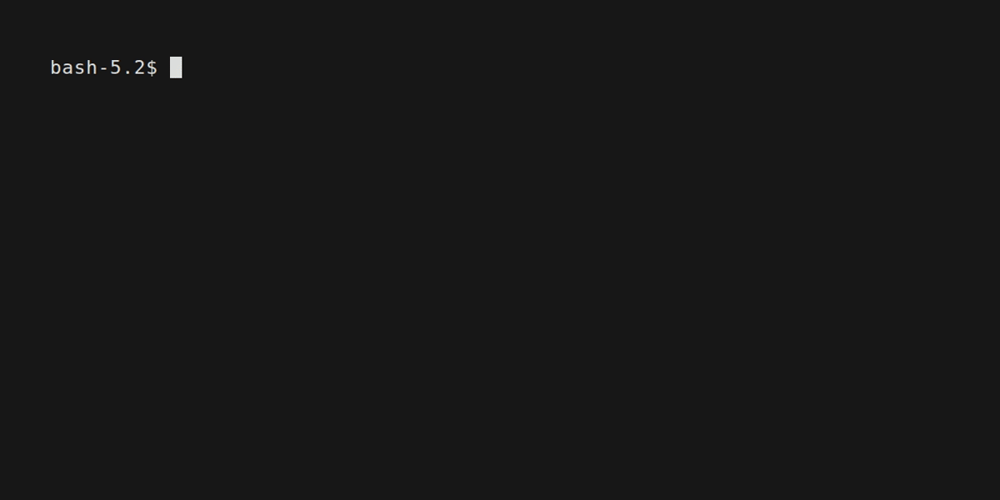

## This is the first, proof of concept version of the application. Further development will be done in different branches.

Q-Metrics Generator

An application for editing and managing the Q-Metrics Engineering Artetfact, consisting of a C# backend and a Next.js frontend.

## Project Structure

```
Generator/
├── .gitignore
├── .gitlab-ci.yml       # Combined CI/CD configuration
├── docker-compose.yml   # Orchestration for both services
├── README.md            # This file
├── client/              # Next.js frontend application
│   ├── Dockerfile
│   ├── package.json
│   ├── next.config.ts
│   ├── tsconfig.json
│   ├── eslint.config.mjs
│   ├── postcss.config.mjs
│   ├── public/
│   └── src/
│       ├── app/
│       ├── components/
│       ├── types/
│       └── constants/
└── server/              # C# .NET backend API
    ├── Dockerfile
    ├── generator_backend_cs.csproj
    ├── generator_backend_cs.sln
    ├── main.cs
    ├── AMLEditor.cs
    └── *.aml files     # Default Q-Metrics AML Artefact
```

## Quick Start

### Using Docker Compose (Recommended)

Build and run both services from the root directory:

```bash
docker compose up --build
```

Access the application:

- **Frontend**: http://localhost:3000



## Building Individual Services

### Backend

```bash
cd server
docker build -t generator-backend .
docker run -p 8080:8080 generator-backend
```

### Frontend

```bash
cd client
docker build -t generator-frontend .
docker run -p 3000:3000 generator-frontend
```

## Environment Variables

### Backend

- `ASPNETCORE_ENVIRONMENT`: Production/Development
- `ASPNETCORE_URLS`: Server binding URL (default: http://+:8080)
- `LOG_LEVEL`: Trace/Debug/Information/Warning/Error/Critical

### Frontend

- `NEXT_PUBLIC_BACKEND_URL`: Backend API URL (default: http://backend:8080)

## Documentation

- [Client Documentation](client/README.md)
- [Server Documentation](server/README.md)

## Features

### Frontend

- Interactive hierarchy viewer
- Real-time attribute editing
- Role-based editing modes (Values/Weights)

### Backend

- AML file parsing and manipulation
- Score calculation
- Multi-editor support
- RESTful API

## Tech Stack

### Frontend

- Next.js 15.5.2
- React 19.1.0
- TypeScript 5
- Tailwind CSS 4

### Backend

- .NET 8.0
- ASP.NET Core
- Aml.Engine 4.4.4

## Troubleshooting

### Port Already in Use

If ports 3000 or 8080 are already in use, modify the port mappings in `docker-compose.yml`:

```yaml
ports:
  - "3001:3000" # Change host port to 3001
```

### Build Failures

Clean Docker cache and rebuild:

```bash
docker compose down
docker system prune -a
docker compose up --build
```

## License

This project is licensed under the MIT License - see the [LICENSE](LICENSE) file for details.
